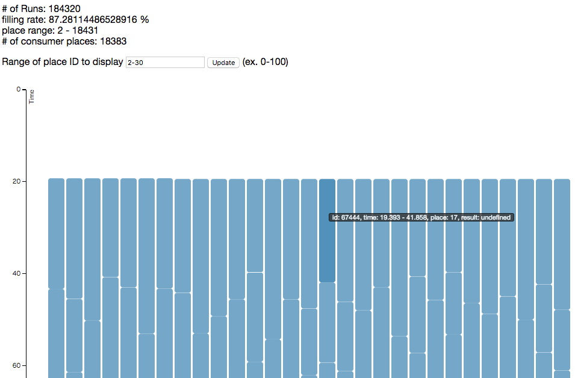

# CARAVAN viz

A tool for visualizing task scheduling of [CARAVAN](https://github.com/crest-cassia/caravan).

## Usage

Install Ruby 2.0 or later. If you do not have 'bundler' gem, please install it:

```
gem install bundler
```

Install dependent gems:

```
bundle
```

Then, run the server giving the output file of CARAVAN as command line arguments:

```
bundle exec ruby server.rb tasks.msgpack
```

Access the following pages to see the results.

- http://localhost:4567

You'll see the plots like the following.
The horizontal and vertical axes indicates the index of places (processes) and time, respectively.
Each bar indicates how long each task runs. If the bars are filled without gaps, it indicates the scheduling went well.



